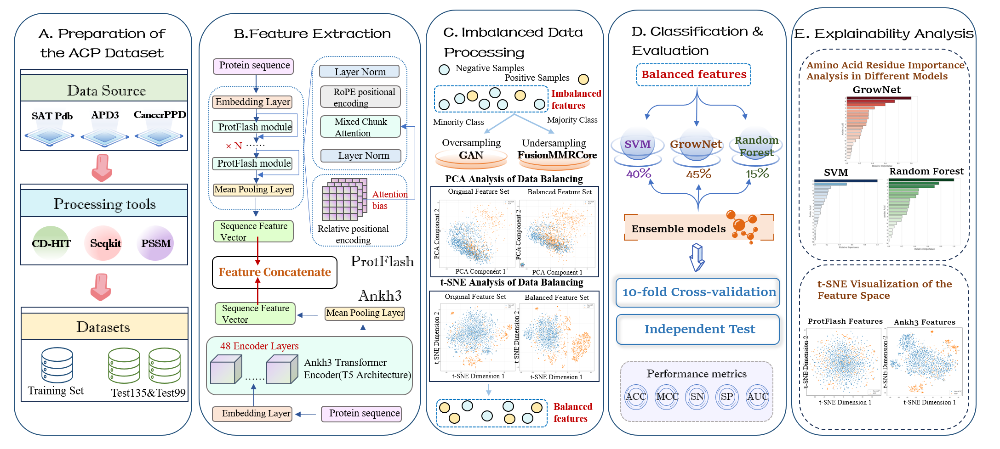
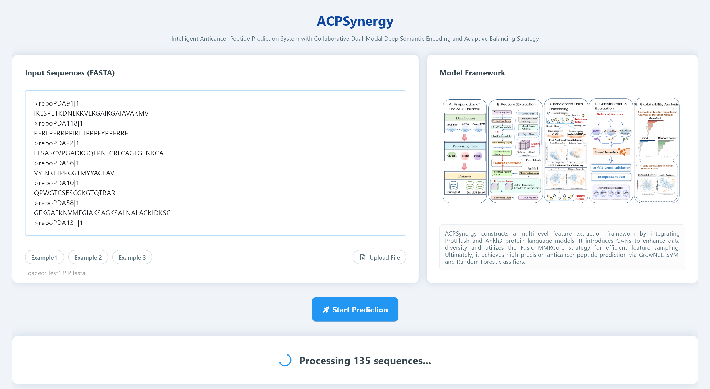
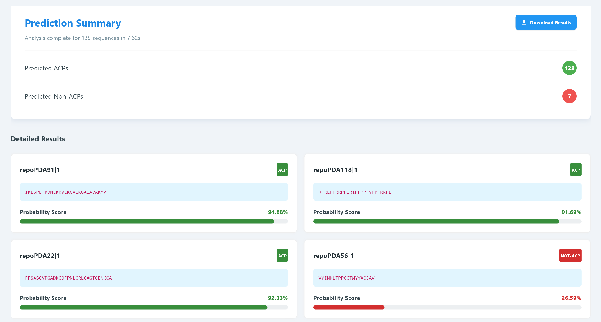

# ACPSynergy

**ACPSynergy: An Intelligent Prediction System for Anticancer Peptides via Synergistic Bimodal Deep Semantic Encoding and Adaptive Balancing Strategy with Interpretability Framework**

ACPSynergy constructs a multi-level feature extraction framework by integrating ProtFlash and Ankh3 protein language models. It introduces GANs to enhance data diversity and utilizes the FusionMMRCore strategy for efficient feature sampling. Ultimately, it achieves high-precision anticancer peptide prediction via GrowNet, SVM, and Random Forest classifiers.

## File Description

**Code Folder**：Contains core code files for model training, testing, and prediction.
- **Feature Extraction.py**：Feature extraction script that uses ProtFlash and Ankh3 protein language models to extract deep semantic features from raw sequences, followed by dimensionality reduction and fusion processing.
- **Train.py**： Model training script that builds three base learners (GrowNet, SVM, and Random Forest) based on extracted features, employs hybrid resampling strategies to balance data, optimizes model parameters through 10-fold cross-validation, and ultimately saves the three base models and the ensemble model.
- **Test.py**：Model testing script that evaluates the generalization performance of the ensemble model on two independent test sets (ACP135 and ACP99).
- **Predict.py**：Visual prediction platform script that provides an interactive interface based on the Flet framework, supporting sequence input, file upload, real-time prediction, and result export functionality.

**Dataset Folder**：Rigorously redundancy-reduced datasets with detailed composition as follows:

| Dataset | Positive Samples | Negative Samples | Total Samples  |
|:------:|:--------:|:--------:|:--------:|
| Training Set | 487 | 1479 | 1966  |
| ACP135 | 135 | 360 | 495 |
| ACP99 | 194 | 194 | 388  |

**Features Folder**： Stores multi-level feature vectors extracted from training and testing sets, including ProtFlash features (512 dimensions reduced to 256), Ankh3 features (1536 dimensions reduced to 256), fused features (512 dimensions), along with corresponding preprocessor objects and label files.

**models Folder**：Contains trained model files.
- **cv_models Subfolder**：Stores model files from each fold during 10-fold cross-validation (10 files each for GrowNet, SVM, and Random Forest).
- **final_models Subfolder**：Stores final ensemble model files, including GrowNet weight file (grownet.pth), SVM classifier (svm.pkl), Random Forest classifier (rf.pkl), and model configuration file (config.pkl).

**ProtFlash Folder**：Used to cache downloaded files of the ProtFlash pretrained model. The model will be automatically downloaded on first run.

**ankh3 Folder**：Stores the Ankh3 pretrained model. Due to the large size of the pretrained Ankh3-Large model (approximately 7GB), it has not been uploaded to GitHub. Please download from HuggingFace: https://huggingface.co/ElnaggarLab/ankh-large. After downloading, place all files in this folder.

## Usage Instructions

### 1.  Environment Setup

```bash
# Create virtual environment
conda create -n acpsynergy python=3.11
conda activate acpsynergy

# Install dependencies
pip install torch torchvision torchaudio
pip install transformers scikit-learn numpy pandas joblib biopython flet
pip install git+https://github.com/BAAI-WuDao/ProtFlash.git
pip install cupy-cuda11x 

# Download Ankh3 model 
# Download from https://huggingface.co/ElnaggarLab/ankh-large to ./ankh3/ directory
```

### 2. Feature Extraction

```bash
python Code/Feature Extraction.py
```

Generated feature files will be saved in the Features/ folder.

### 3. Model Training

```bash
python Code/Train.py
```

After training is complete, model files will be saved in the models/final_models/ folder.

### 4.  Model Testing

```bash
python Code/Test.py
```

Test results will be displayed in the console, including evaluation metrics such as ACC, MCC, SN, SP, and AUC.

### 5. Visual Prediction Platform

```bash
python Code/Predict.py
```

After launching, an interactive prediction interface will open, supporting sequence input, file upload, real-time prediction, result visualization, and CSV export functionality.

## Performance Results

|      Method    | ACC | MCC | SN | SP | AUC |
|:------------:|:----:|:----:|:----:|:----:|:----:|
|   10-Fold Cross-Validation    | 0.9730 | 0.9282 | 0.9466 | 0.9824 | 0.9889 |
| Independent Test (ACP135) | 0.9677 | 0.9189 | 0.9481 | 0.9750 | 0.9926 |
| Independent Test (ACP99) | 0.9639 | 0.9303 | 0.9278 | 1.0000 | 0.9865 |


## Contact Information

For any questions or issues, please contact:
Email: 1191230413@stu.jiangnan.edu.cn
